# Lane Detection With Semantic Segmentation

This repository explores lane detection using semantic segmentation on BDD100K driving-scene images.

The project generates lane labels from raw road images, trains a segmentation model, and visualizes predicted lane regions, overlays, and intermediate feature maps.

## Dataset

- **Dataset**: BDD100K
- **Task**: Lane-region segmentation from road-scene images
- **Label generation**: Canny edge detector-based preprocessing for training labels

## Workflow

1. Generate lane labels for training images.
2. Train a semantic-segmentation model on the labeled image set.
3. Evaluate the trained model on road-scene examples.
4. Visualize raw inputs, generated labels, model outputs, overlays, and feature maps.

## Raw Images

  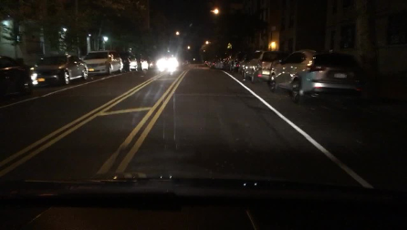 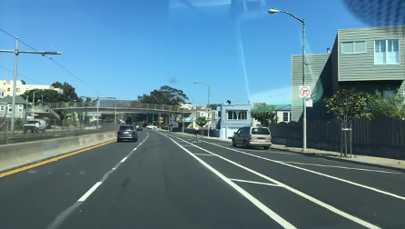

## Generated Labels

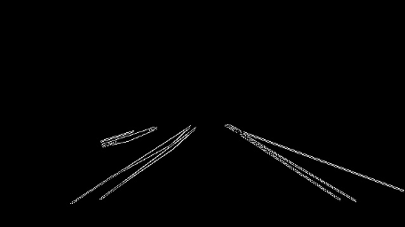 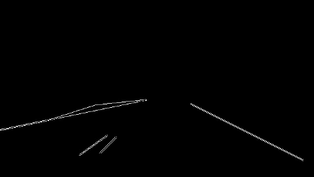 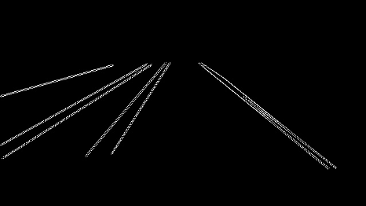 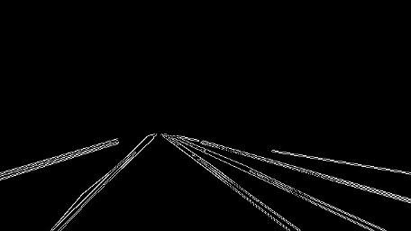

## Labels Overlaid On Images

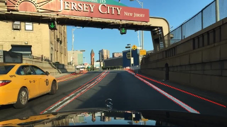 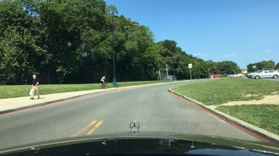 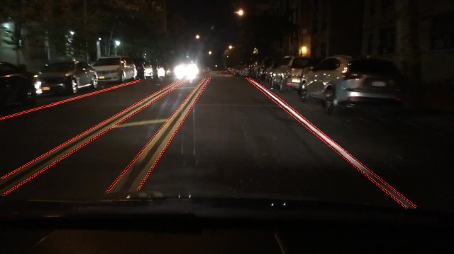 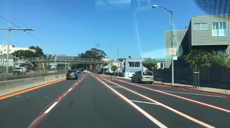

## Model Outputs

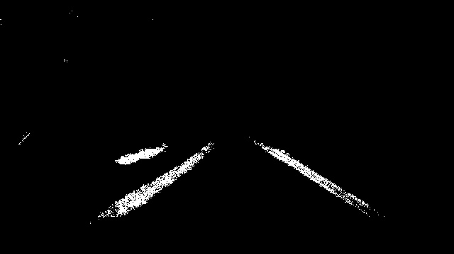 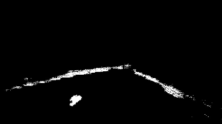 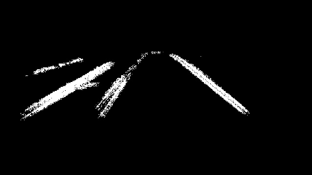 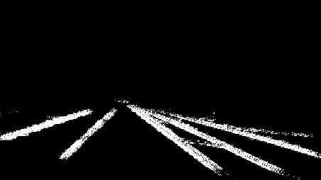

## Final Output Overlays

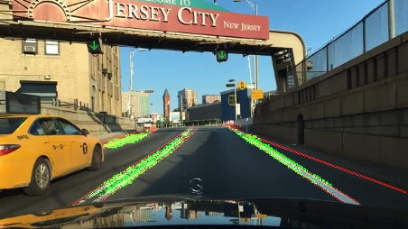 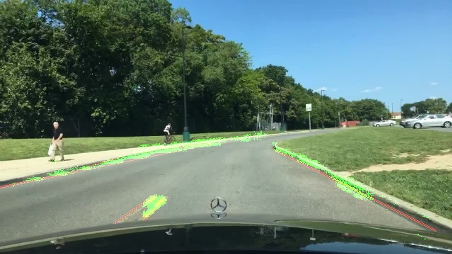 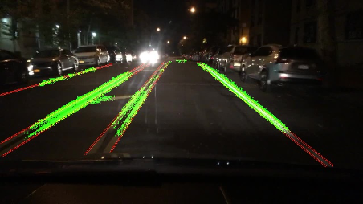 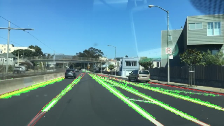

## Feature Map Visualization

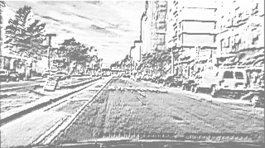 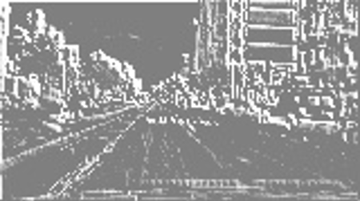 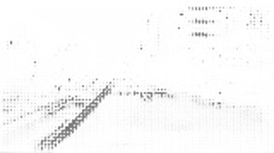 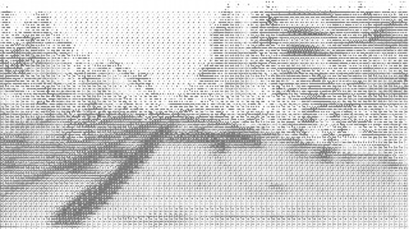 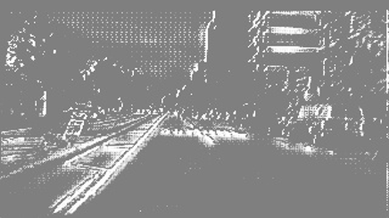 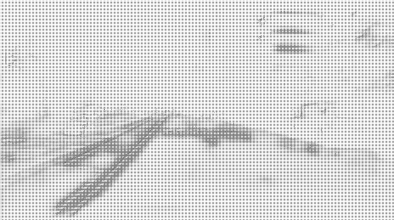
